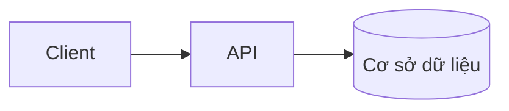

# Architecture overview: {{.Title}}

<!-- gợi ý: Sơ đồ trước, văn xuôi sau. Soạn từ mã nguồn thật khi có (cấu trúc thư mục, file cấu hình); thành phần suy đoán đánh dấu "chưa xác nhận" ở bảng mục 2, người xác nhận từng dòng. Cập nhật khi thêm hoặc bỏ thành phần. Chi tiết từng thành phần tách sang ADR khi vượt 400 dòng. -->

## 1. Sơ đồ thành phần

<!-- gợi ý: mỗi nút một thành phần chạy độc lập (dịch vụ, cơ sở dữ liệu, hàng đợi, client); mũi tên là luồng dữ liệu chính. Không vẽ chi tiết bên trong một thành phần. -->

## 2. Thành phần

<!-- gợi ý: mỗi nút trong sơ đồ một dòng. Cột "Xác nhận": đã xác nhận | chưa xác nhận (suy đoán từ mã, chờ người xác nhận). -->

| Thành phần | Vai trò | Nơi trong mã | Xác nhận |
|---|---|---|---|
| | | | chưa xác nhận |

## 3. Luồng dữ liệu

<!-- gợi ý: hai đến ba luồng chính, mỗi luồng một đoạn ngắn theo thứ tự thành phần đi qua -->

## 4. Ranh giới hệ thống

<!-- gợi ý: hệ thống ngoài (dịch vụ thứ ba, hệ thống cũ) và giao tiếp qua gì; thứ nằm ngoài trách nhiệm của dự án -->

- 

## 5. Tech stack

| Lớp | Công nghệ | Phiên bản | Lý do hoặc ADR |
|---|---|---|---|
| | | | |

## 6. Quyết định liên quan

<!-- gợi ý: liên kết đến từng ADR còn hiệu lực trong docs/adr/; không chép nội dung, không liên kết file chưa có -->

- 
