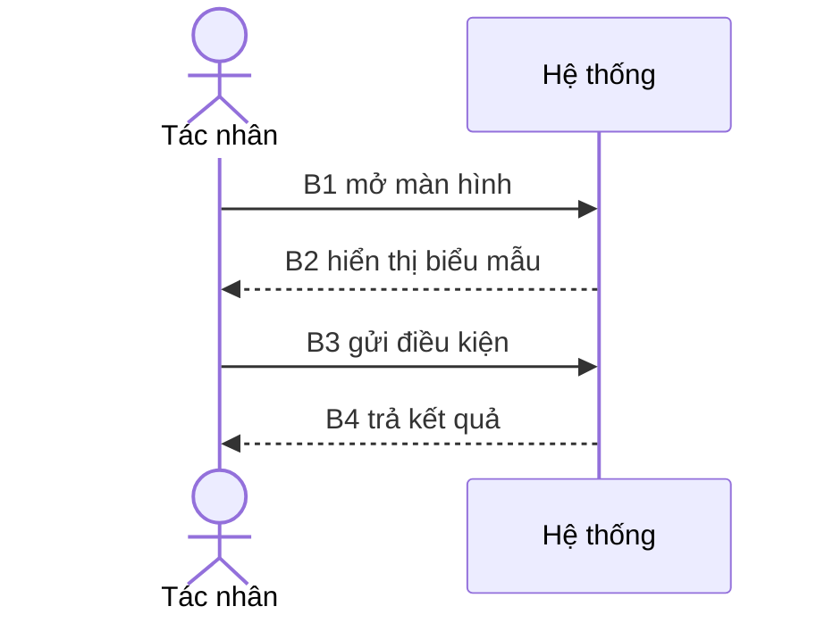
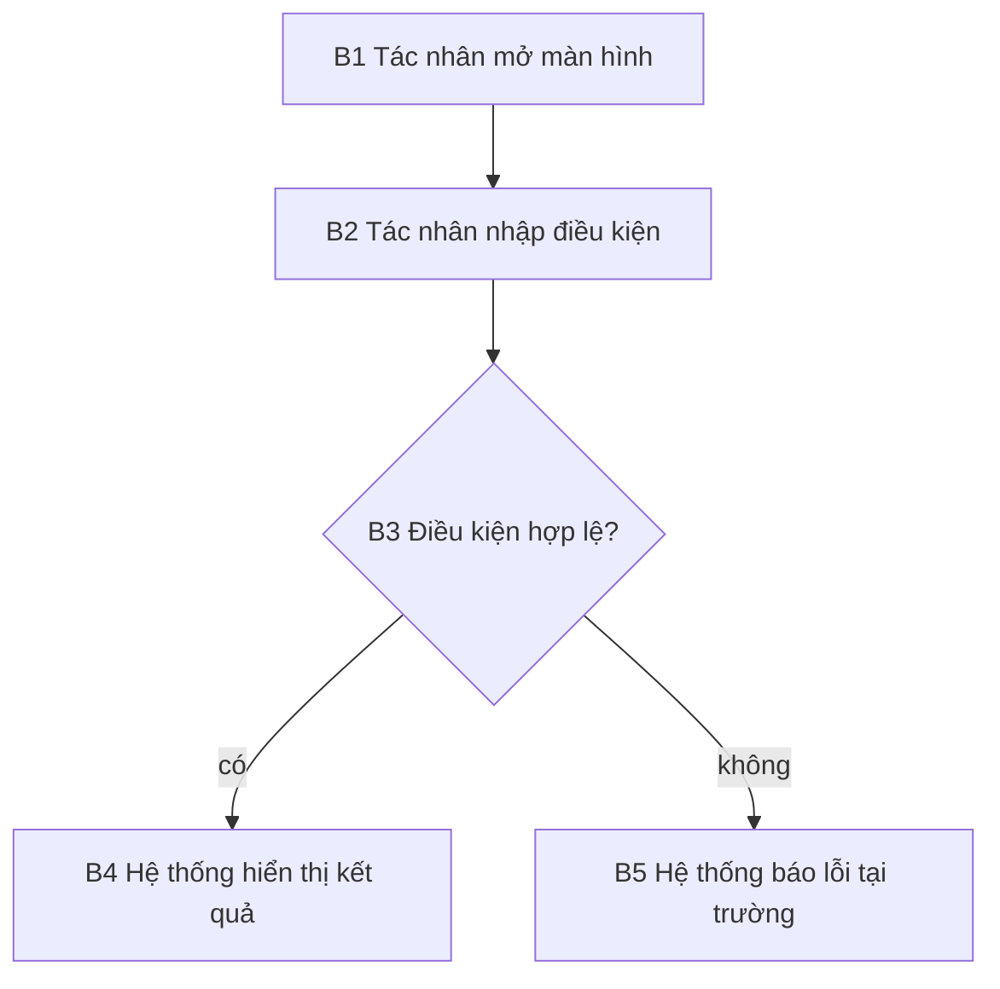
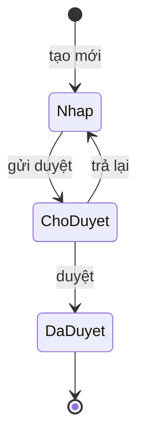

# {{.ID}}: {{.Title}}

<!-- gợi ý: status: draft | review (chờ duyệt) | approved (đã duyệt) | implemented (đã phát hành) | deprecated (bãi bỏ); format: spec | use-case | story | crud | state; has_ui: false thì bỏ mục 5. Một file cho một tính năng. Sơ đồ là mục lục, bảng hành vi là diễn giải từng nút; ràng buộc bằng mã bước B1, B2... Chèn bước giữa B2 và B3 thì đặt B2a, không đánh số lại. Sửa hành vi thì sửa đây trước. Ngoại lệ chiếm ít nhất một nửa giá trị tài liệu. -->

## 1. Mục đích và giá trị

<!-- gợi ý: người dùng làm được gì mà trước không làm được? Vì sao đáng làm? Hai đến ba câu, lấy từ mục 1 của brief. -->

## 2. Tác nhân và điều kiện tiên quyết

<!-- gợi ý: ai dùng (vai trò), cần đăng nhập không, cần dữ liệu gì có sẵn, quyền gì -->

- Tác nhân: 
- Điều kiện tiên quyết: 
{{if ne .Format "crud"}}
## 3. Sơ đồ luồng chính
{{if eq .Format "use-case"}}
<!-- gợi ý: nhiều thành phần tương tác theo thứ tự thì dùng sequenceDiagram; mỗi thông điệp mang mã bước, trùng với bảng luồng chính ở mục 4. -->


{{else}}
<!-- gợi ý: một sơ đồ cho luồng chính, mỗi nút mang mã bước. Chuỗi hành động có rẽ nhánh: flowchart; nhiều thành phần tương tác theo thứ tự: sequenceDiagram; vòng đời trạng thái: stateDiagram. Luồng tuyến tính dưới bốn bước hoặc CRUD đơn giản thì bỏ sơ đồ, bảng hành vi là đủ. Nhánh rẽ ghi nhãn trên mũi tên; ngoại lệ để mục 6, không nhồi vào đây. -->


{{end}}{{if eq .Format "state"}}
### Vòng đời trạng thái

<!-- gợi ý: một đối tượng, mỗi trạng thái một nút, mỗi chuyển trạng thái ghi sự kiện gây ra; tên trạng thái trùng với cột dữ liệu đổi ở mục 4 -->


{{end}}{{end}}
{{if eq .Format "crud"}}## 4. Bảng field và quyền

<!-- gợi ý: CRUD đơn giản không cần sơ đồ và use case. Mỗi field một dòng; cột quyền ghi vai trò được xem, sửa. Kết quả mỗi thao tác tạo, sửa, xóa ghi ở mục 6 nếu có ngoại lệ. -->

| Field | Kiểu | Bắt buộc | Quyền xem | Quyền sửa | Ghi chú |
|---|---|---|---|---|---|
| | | | | | |
{{else if eq .Format "use-case"}}## 4. Use Case Specification

<!-- gợi ý: tiền điều kiện và hậu điều kiện kiểm chứng được; bảng luồng chính dùng đúng mã bước trong sơ đồ mục 3, mỗi dòng một cặp hành động và phản hồi quan sát được -->

- Tên use case: 
- Tác nhân chính: 
- Tiền điều kiện: 
- Hậu điều kiện: 

| Mã | Hành động của tác nhân | Phản hồi quan sát được của hệ thống |
|---|---|---|
| B1 | | |
| B2 | | |
| B3 | | |
| B4 | | |
{{else}}## 4. Hành vi theo mã bước

<!-- gợi ý: mỗi dòng một cặp hành động của tác nhân và phản hồi quan sát được. Không viết "hệ thống xử lý" mà không nói kết quả nhìn thấy: thông báo gì, dữ liệu đổi thế nào, sự kiện nào phát ra. Mã bước trùng 100% với sơ đồ mục 3. -->

| Mã | Hành động của tác nhân | Phản hồi quan sát được của hệ thống |
|---|---|---|
| B1 | | |
| B2 | | |
| B3 | | |
| B4 | | |
| B5 | | |
{{end}}{{if .HasUI}}
## 5. Giao diện

<!-- gợi ý: mỗi mã bước liên kết đến mockup của màn hình tương ứng và trạng thái hiển thị. Chỉ liên kết, không chép ảnh. Chưa có mockup thì ghi "chưa có, xem họ Design". Tính năng không có giao diện: tạo lại với --set has_ui=false. -->

{{if eq .Format "crud"}}| Màn hình | Mockup | Trạng thái hiển thị |
|---|---|---|
| Danh sách | chưa có, xem họ Design | |
| Biểu mẫu | chưa có, xem họ Design | |{{else}}| Mã bước | Mockup | Trạng thái hiển thị |
|---|---|---|
| B1 | chưa có, xem họ Design | |{{end}}
{{end}}
## 6. Luồng thay thế và ngoại lệ

<!-- gợi ý: mỗi ngoại lệ ghi mã bước phát sinh, điều kiện, phản hồi quan sát được. Mục này chiếm ít nhất nửa số dòng bảng hành vi. Nhánh thay thế cần bước riêng thì đặt mã hậu tố theo bước gốc (B2a, B2b) và thêm vào sơ đồ, bảng mục 4. -->

| Mã | Tại bước | Điều kiện | Phản hồi quan sát được |
|---|---|---|---|
| E1 | | | |

## 7. Quy tắc nghiệp vụ

<!-- gợi ý: tham chiếu bằng mã R1, R2...; quy tắc dùng chung nhiều spec thì liên kết đến nơi định nghĩa, không lặp lại; ràng buộc từ mục 2 của brief ghi ở đây -->

| Mã | Quy tắc | Nguồn |
|---|---|---|
| R1 | | |
{{if eq .Format "story"}}
## 8. Tiêu chí chấp nhận

<!-- gợi ý: Gherkin thuần, chạy được thành test; mỗi Scenario một tiêu chí, nêu thông báo cụ thể, dữ liệu đổi, sự kiện phát -->

```gherkin
Feature: {{.Title}}

  Scenario: AC1 
    Given 
    When 
    Then 
```
{{else}}
## 8. Tiêu chí chấp nhận

<!-- gợi ý: Given / When / Then, đánh số AC1, AC2...; mỗi tiêu chí kiểm chứng được: thông báo cụ thể, dữ liệu đổi thế nào, sự kiện nào phát ra; mục 4 của brief chép vào đây; mục này nuôi Test case -->

- AC1. **Given** ... **When** ... **Then** ...
{{end}}
## 9. Dữ liệu và API liên quan

<!-- gợi ý: chỉ liên kết đến Data model, API spec, ADR; không chép lại -->

- 

## 10. Ngoài phạm vi

<!-- gợi ý: thứ cố ý không làm trong tính năng này; lấy từ mục 3 của brief -->

- 
