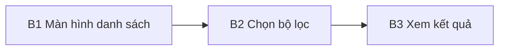

# User flow: {{.Title}}

<!-- gợi ý: feature: mã Feature Spec; mã bước trong sơ đồ là tập con mã bước của spec đó (dk check userflow-steps). Spec chưa có mã bước: đề xuất ở đây, spec dùng lại. Mỗi nút là một màn hình hoặc hành động, mang mã bước. source: brief hoặc CR. -->

## 1. Sơ đồ

## 2. Màn hình theo mã bước

<!-- gợi ý: mỗi mã bước một dòng: màn hình, trạng thái quan trọng cần mockup (bình thường, rỗng, lỗi, đang tải), liên kết wireframe và mockup khi có -->

| Mã bước | Màn hình | Trạng thái cần mockup | Wireframe | Mockup |
|---|---|---|---|---|
| B1 | | bình thường, rỗng, đang tải | | |

## 3. Điểm quyết định

<!-- gợi ý: rẽ nhánh nào do người dùng, nhánh nào do hệ thống; điều kiện -->
