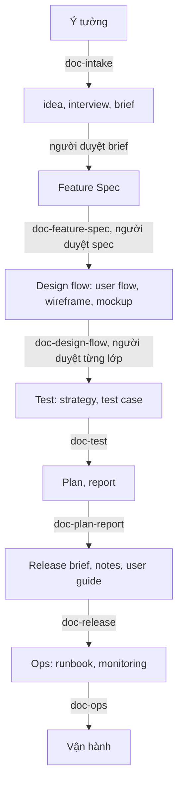

# Quy trình dùng bộ skill

Trả lời câu hỏi của người mới: có ý tưởng thì gọi skill nào trước, bao giờ tới lượt mình
duyệt, rồi tiếp theo gọi gì. Chi tiết từng skill ở [`skill.md`](skill.md), từng lệnh ở
[`lenh.md`](lenh.md). Thứ tự dưới đây lấy từ lần chạy trọn vòng trên dự án mẫu.

## Nguyên tắc chung

- Agent chỉ soạn nháp và dừng ở trạng thái `review`. Người đọc, sửa, rồi tự đổi `status`
  sang trạng thái đã chốt (`approved`, `accepted`, `ready`). Skill không bao giờ tự chốt.
- Mỗi tài liệu chốt xong mới là đầu vào cho bước sau. Brief chưa `approved` thì không có
  Feature Spec; spec chưa `approved` thì không có test case.
- Sau mỗi lần sửa một tài liệu, skill tự chạy `dk changelog add`, `dk render`,
  `dk index`, `dk check`. Người không cần nhớ, nhưng pre-commit sẽ chặn nếu thiếu.

## Vòng đời một tính năng

Thứ tự thật khi chạy: intake → duyệt brief → design flow → spec → test → plan → release.
Design flow và spec có thể đổi chỗ; `dk check` báo lỗi `userflow-steps` cho đến khi spec
xuất hiện, đó là lỗi tạm, không cần sửa tay.

## Vòng thay đổi

Thứ đã có mà muốn đổi thì không đi qua intake. Gọi `doc-cr`: agent soạn Change Request kèm
bảng tác động lấy từ `dk refs`, dừng ở `review`. Người duyệt, đổi sang `approved`. Sau đó
gọi lần lượt các skill của họ tài liệu có dòng "Có" trong bảng tác động, mỗi lần kèm mã CR;
skill ghi `--source <CR-id>` vào changelog và đổi `source` của tài liệu.

## Khi nào gọi gì

| Tình huống | Gọi | Nói với agent | Bạn phải làm |
|---|---|---|---|
| Có ý tưởng mới, chưa có gì | `doc-intake` | "Tôi có ý tưởng: ..." | Trả lời phỏng vấn từng trường "chưa rõ"; duyệt brief |
| Dự án mới, chưa có tài liệu nền | `doc-intake` cấp `project`, rồi `doc-overview` | "Lập Product brief cho dự án" | Duyệt Product brief; đọc Architecture overview sinh từ mã |
| Giao diện chưa có design system | `doc-intake` kind `design`, rồi `doc-design-system` | "Lập Design brief" | Duyệt brief; duyệt từng lớp tokens, atoms, organisms |
| Brief đã `approved` | `doc-feature-spec` | "Soạn Feature Spec từ brief <thư mục>" | Chọn `format` nếu agent hỏi; duyệt spec |
| Spec đã `approved`, có giao diện | `doc-design-flow` | "Làm user flow và mockup cho F-xxx" | Duyệt flow trước wireframe, wireframe trước mockup |
| Spec đã `approved` | `doc-test` | "Lập test cho F-xxx" | Chốt strategy lần đầu (`gherkin` hay `table`) |
| Bắt đầu làm | `doc-plan-report` | "Lập plan cho F-xxx" | Duyệt phạm vi; cuối đợt yêu cầu report |
| Sắp phát hành | `doc-release` | "Soạn release brief cho F-xxx" rồi "Gộp release notes v1.2.0" | Đặt brief sang `ready`; đọc bằng mắt người không kỹ thuật |
| Lên production | `doc-ops` | "Viết runbook cho sự cố ..." | Điền secret và host thật ngoài tài liệu |
| Muốn đổi thứ đã có | `doc-cr` | "Tôi muốn đổi ...: ..." | Duyệt CR; gọi tiếp các họ có dòng "Có" |
| Quyết định kỹ thuật lớn | `doc-adr` | "Ghi ADR về ..." | Trả lời từng câu; đổi sang `accepted`, sau đó thân bất biến |

## Lần đầu với dự án mới

1. `dk init`, `dk skill install`, `dk hook install`, `dk init --agent-context`, `dk doctor`.
2. `doc-intake` cấp `project` kind `product`, duyệt, rồi `doc-overview`.
3. Có giao diện: `doc-intake` kind `design`, duyệt, rồi `doc-design-system` theo từng lớp.
4. Tính năng đầu tiên theo vòng đời ở trên.

Bước 2 và 3 làm một lần. Từ tính năng thứ hai chỉ còn vòng đời và vòng thay đổi.

## Kiểm nhanh

- `dk status`: số tài liệu theo trạng thái, CR đang mở, changelog còn thiếu.
- `dk check`: mã 3 khi có lỗi; cảnh báo `spec-has-test`, `backlink` là bình thường khi tài
  liệu phía sau chưa có.
- `dk doctor`: cài đặt đủ chưa, trước khi mở agent.
